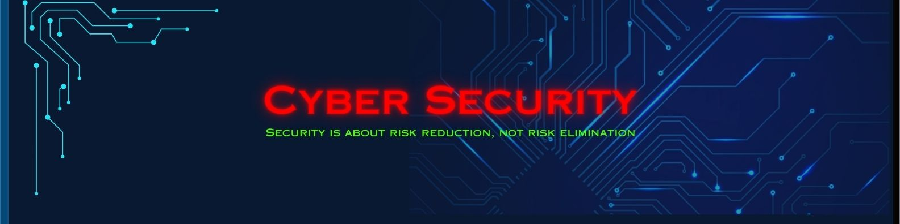

<h1 align="center">Hii ... This is Rajeev</h1>
<h3 align="center">A passionate cyber security learner from India</h3>

  

-  I’m currently working on **Aegis Key**
-  Ex-Intern at **Codesnag**
-  I’m currently focusing on **Cybersecurity**
-  How to reach me **rajee1904098@gmail.com**
-  Cyber Security enthusiast from India 🇮🇳
- 🌐 GitHub contributor and advocate for open source collaboration

<h3 align="left">Connect with me:</h3>

<h3 align="left">Languages and Tools:</h3>

         

&nbsp;

